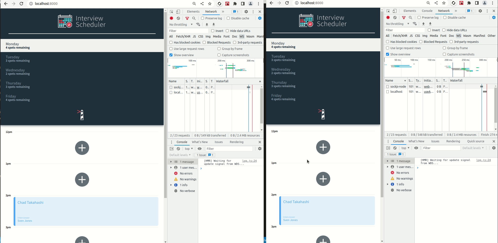
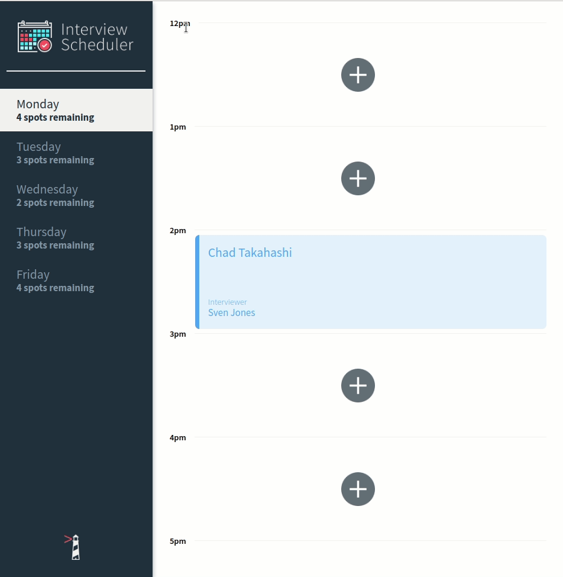
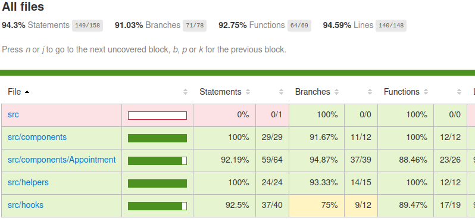

# Interview Scheduler

Interview Scheduler is a single-page application (SPA) that allows users to book interviews between students and mentors.

The template can be found here: [LHL Scheduler](https://github.com/lighthouse-labs/scheduler)

## Getting Started

- **READ THIS BEFORE ANYTHING ELSE**
- **IF RUNNING IN LOCAL MACHINE ON DEV MODE**

  > You will need to have the API server running in order to test the full functionality of the App.

  - Follow the instructions listed here: [LHL Scheduler-API](https://github.com/lighthouse-labs/scheduler-api)

- \*\*I have two branches:
  > Main, the main project
  > web_socket: showcasing my solution to the websocket stretch (refactored to separate file to allow for JEST test suite to pass)

### Setup

Install dependencies with `npm install`.

### Running Webpack Development Server

```sh
npm start
```

### Running Jest Test Framework

```sh
npm test
```

### Running Storybook Visual Testbed

```sh
npm run storybook
```

### Learning Outcomes

- [x] StoryBook
  - Testing components in isolation
  - Pattern recognition and implementation
- [x] React
  - Controlled components
  - useState
  - useEffect --axios, and WebSockets
  - Custom Hooks
  - Immutable Objects and update patterns
  - Parent/child component building
- [x] JSX
  - Component building
  - Understanding Syntax Patterns
  - Passing Props
  - Using [classNames](https://github.com/JedWatson/classnames) for conditional rendering
- [x] Reducer
  - Implement Reducer patterns
  - The difference between Switch and Objects in Reducers
- [x] WebSockets
  - Two browser tabs open will update automatically if one user makes a change, see the view for more

### Future Goals

- [ ] write more tests to bring coverage up
- [ ] refactor newSpots function to operate independently
  > This would allow an state update after a socket response
- [ ] add cookie management and login
- [ ] remove the useVisualMode hook and replace with useContext

### Views

Websocket Demo


Regular Use

Test Coverage


### Known Bugs

- _Clicking the cancel button immediately sends you back, better to have a quick confirmation_

#### Dependencies

- Axios
- @testing-library/react-hooks
- react-test-renderer
- classNames
- Dev
  > StoryBook
  > Cypress
